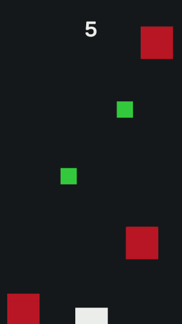

# falling-squares
Небольшая игра, сделанная на Unity

***
### Описание ###

Игрок управляет платформой, которая двигается горизонтально по экрану. 
Платформа двигается только когда пользователь нажимает на экран и меняет направление после каждого нажатия.

* Если на платформу упадет зеленый квадрат, то +1 к игровому счету, игра ускоряется на 1%
* Если на платформу упадет красный квадрат, то game over
  

